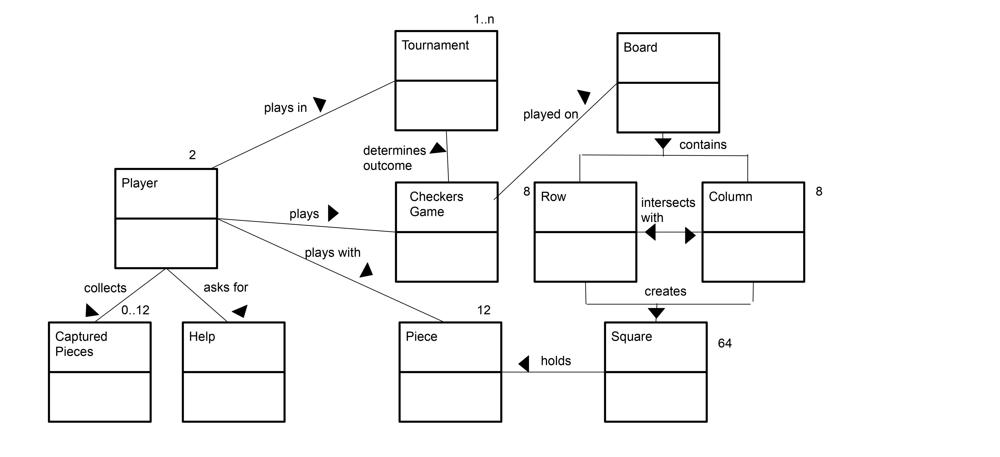
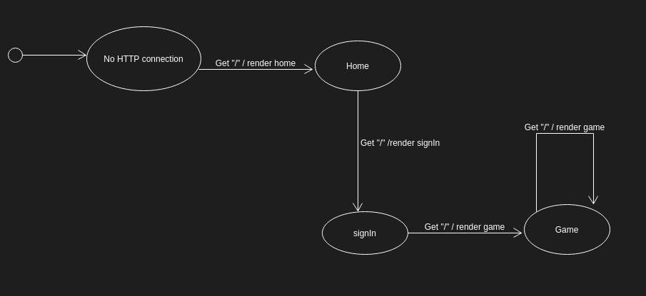

# PROJECT Design Documentation

> _The following template provides the headings for your Design
> Documentation.  As you edit each section make sure you remove these
> commentary 'blockquotes'; the lines that start with a > character
> and appear in the generated PDF in italics._

## Team Information
* Team name: TheBestSwenTeam
* Team members
  * Barak Binyamin
  * Heather Moses
  * Ella Shea
  * Shane Dekker
  * Gideon Wikina

## Executive Summary

The web application Webcheckers allows players 
to play checkers with other online players after signing in to the website.
The game user interface consists of drag-and-drop interactions to the checkers board.

### Purpose
Users play against each other in a game of checkers, competing to capture all of their
opponents pieces before losing all of their own.
> Users: sign in, view active players, start a game, sign out
> Players: make a move, play a game with an opponent, withdraw from a game

### Glossary and Acronyms
>A table of terms and acronyms.

| Term | Definition |
|------|------------|
| VO | Value Object |

## Requirements

This section describes the features of the application.

Players must be able to sign-in to the application, view players in the lobby and 
start a checkers game against other players. Players selected to be in
a game must be redirected to their game.

### Definition of MVP
Players must be able to sign-in to the application, view players in the lobby and 
start a checkers game against other players. Players selected to be in
a game must be redirected to their game.

### MVP Features

<b>Basic piece moves</b>
As a Player, I want to be able to sign-in so that I can play a game of checkers.
As a Player, I want to be able to diagonally jump over my opponents pieces in one turn so that I can eliminate two or more of their pieces.
As a Player, I want to lose the game when I have no moves left so that I can move on and start a new game.

<b>Simple captures</b>
 As a Player who is signed into WebCheckers I want to be able to sign-out so that I am not placed in any new games.

<b>Multi-capture turns</b>
As a Player, I want to start a game so that I can play checkers against an opponent.

<b>Invalid moves including checking for required captures</b>
As a Player, I want to be able to move my pieces diagonally away from me so that I can advance towards the far end of the board.

<b>End of game scenario</b>
As a Player, I want to be forced to make an available jump move so that I will gain an advantage in the game.
<b>Single Jump Move</b>
As a Player, I want to be able to jump diagonally forward with a single piece or in either direction with a King over an opponent piece so that I can eliminate the piece and advance in the game.

<b>Winning</b>
As a Player, I want to win the game by capturing all of my opponent pieces so that I can claim victory.

<b>Kinging of a piece and the new move capabilities the King piece has</b>
As a Player, I want to have my pieces that reach the opponent end of the board to become Kings so that I can move diagonally forwards and backwards.

<b>Resignation</b>
As a Player in an ongoing game I want to be able to forfeit from an ongoing game so that I can return to the lobby.
As a Player, I want to win the game by capturing all of my opponent pieces so that I can claim victory.  

### Roadmap of Enhancements
> _Provide a list of top-level features in the order you plan to consider them._

## Application Domain

This section describes the application domain.

> _Our domain model consists of players, the checkers game, and
>how these entities interact with each other. For example, a player
>plays a checkers game, and each game has a board, which has
>rows, columns, and squares._

## Architecture and Design

This section describes the application architecture.

### Summary

The following Tiers/Layers model shows a high-level view of the webapp's architecture.

As a web application, the user interacts with the system using a
browser.  The client-side of the UI is composed of HTML pages with
some minimal CSS for styling the page.  There is also some JavaScript
that has been provided to the team by the architect.

The server-side tiers include the UI Tier that is composed of UI Controllers and Views.
Controllers are built using the Spark framework and View are built using the FreeMarker framework.  The Application and Model tiers are built using plain-old Java objects (POJOs).

Details of the components within these tiers are supplied below.

### Overview of User Interface

This section describes the web interface flow; this is how the user views and interacts
with the WebCheckers application.

> _As a user uses our interface, an HTTP request is sent to 
>render the home page. Then, the home page renders the sign in.
>After the user signs in and chooses a player to play against, 
>another request is sent to render the game page._

### UI Tier
> _Provide a summary of the Server-side UI tier of your architecture.
> Describe the types of components in the tier and describe their
> responsibilities.  This should be a narrative description, i.e. it has
> a flow or "story line" that the reader can follow._

> _At appropriate places as part of this narrative provide one or more
> static models (UML class structure or object diagrams) with some
> details such as critical attributes and methods._

> _You must also provide any dynamic models, such as statechart and
> sequence diagrams, as is relevant to a particular aspect of the design
> that you are describing.  For example, in WebCheckers you might create
> a sequence diagram of the `POST /validateMove` HTTP request processing
> or you might show a statechart diagram if the Game component uses a
> state machine to manage the game._

> _If a dynamic model, such as a statechart describes a feature that is
> not mostly in this tier and cuts across multiple tiers, you can
> consider placing the narrative description of that feature in a
> separate section for describing significant features. Place this after
> you describe the design of the three tiers._

### Application Tier
> _Provide a summary of the Application tier of your architecture. This
> section will follow the same instructions that are given for the UI
> Tier above._

### Model Tier
> _Provide a summary of the Application tier of your architecture. This
> section will follow the same instructions that are given for the UI
> Tier above._

### Design Improvements
> _Discuss design improvements that you would make if the project were
> to continue. These improvement should be based on your direct
> analysis of where there are problems in the code base which could be
> addressed with design changes, and describe those suggested design
> improvements. After completion of the Code metrics exercise, you
> will also discuss the resutling metric measurements.  Indicate the
> hot spots the metrics identified in your code base, and your
> suggested design improvements to address those hot spots._

## Testing
> _This section will provide information about the testing performed
> and the results of the testing._

### Acceptance Testing
> _Report on the number of user stories that have passed all their
> acceptance criteria tests, the number that have some acceptance
> criteria tests failing, and the number of user stories that
> have not had any testing yet. Highlight the issues found during
> acceptance testing and if there are any concerns._

### Unit Testing and Code Coverage
> _Discuss your unit testing strategy. Report on the code coverage
> achieved from unit testing of the code base. Discuss the team's
> coverage targets, why you selected those values, and how well your
> code coverage met your targets. If there are any anomalies, discuss
> those._
