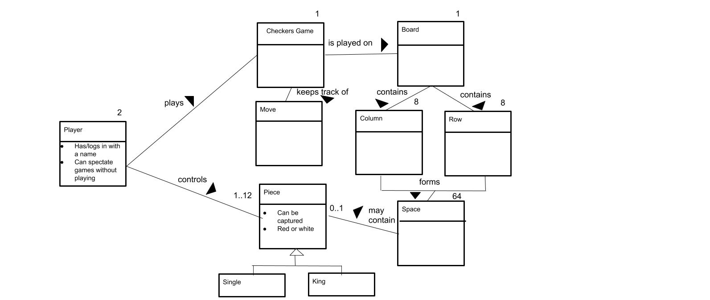

# PROJECT Design Documentation

> _The following template provides the headings for your Design
> Documentation.  As you edit each section make sure you remove these
> commentary 'blockquotes'; the lines that start with a > character
> and appear in the generated PDF in italics._

## Team Information
* Team name: TheBestSwenTeam
* Team members
  * Barak Binyamin
  * Heather Moses
  * Ella Shea
  * Shane Dekker
  * Gideon Wikina

## Executive Summary

The web application Webcheckers allows players 
to play checkers with other online players after signing in to the website.
The game user interface consists of drag-and-drop interactions to the checkers board.

### Purpose
Users play against each other in a game of checkers, competing to capture all of their
opponents pieces before losing all of their own.
> Users: sign in, view active players, start a game, sign out
> Players: make a move, play a game with an opponent, withdraw from a game

### Glossary and Acronyms
>A table of terms and acronyms.

| Term | Definition |
|------|------------|
| VO | Value Object |

## Requirements

This section describes the features of the application.

Players must be able to sign-in to the application, view players in the lobby and 
start a checkers game against other players. Players selected to be in
a game must be redirected to their game.

### Definition of MVP
Players must be able to sign-in to the application, view players in the lobby and 
start a checkers game against other players. Players selected to be in
a game must be redirected to their game.

### MVP Features

<b>Basic piece moves</b>
As a Player, I want to be able to sign-in so that I can play a game of checkers.
As a Player, I want to be able to diagonally jump over my opponents pieces in one turn so that I can eliminate two or more of their pieces.
As a Player, I want to lose the game when I have no moves left so that I can move on and start a new game.

<b>Simple captures</b>
 As a Player who is signed into WebCheckers I want to be able to sign-out so that I am not placed in any new games.

<b>Multi-capture turns</b>
As a Player, I want to start a game so that I can play checkers against an opponent.

<b>Invalid moves including checking for required captures</b>
As a Player, I want to be able to move my pieces diagonally away from me so that I can advance towards the far end of the board.

<b>End of game scenario</b>
As a Player, I want to be forced to make an available jump move so that I will gain an advantage in the game.
<b>Single Jump Move</b>
As a Player, I want to be able to jump diagonally forward with a single piece or in either direction with a King over an opponent piece so that I can eliminate the piece and advance in the game.

<b>Winning</b>
As a Player, I want to win the game by capturing all of my opponent pieces so that I can claim victory.

<b>Kinging of a piece and the new move capabilities the King piece has</b>
As a Player, I want to have my pieces that reach the opponent end of the board to become Kings so that I can move diagonally forwards and backwards.

<b>Resignation</b>
As a Player in an ongoing game I want to be able to forfeit from an ongoing game so that I can return to the lobby.
As a Player, I want to win the game by capturing all of my opponent pieces so that I can claim victory.  

### Roadmap of Enhancements
> _1. Spectator Mode_
> _2. Get Help_

## Application Domain

This section describes the application domain.

> _Our domain model consists of players, the checkers game, and
>how these entities interact with each other. For example, a player
>plays a checkers game, and each game has a board, which has
>rows, columns, and squares._

## Architecture and Design

This section describes the application architecture.

### Summary

The following Tiers/Layers model shows a high-level view of the webapp's architecture.

As a web application, the user interacts with the system using a
browser.  The client-side of the UI is composed of HTML pages with
some minimal CSS for styling the page.  There is also some JavaScript
that has been provided to the team by the architect.

The server-side tiers include the UI Tier that is composed of UI Controllers and Views.
Controllers are built using the Spark framework and View are built using the FreeMarker framework.  The Application and Model tiers are built using plain-old Java objects (POJOs).

Details of the components within these tiers are supplied below.

### Overview of User Interface

This section describes the web interface flow; this is how the user views and interacts
with the WebCheckers application.

> _As a user uses our interface, an HTTP request is sent to 
>render the home page. Then, the home page renders the sign in.
>After the user signs in and chooses a player to play against, 
>another request is sent to render the game page._

### UI Tier
> ####Web Server
>The Web Server handles all of the routing that our program
>is responsible for. For example, it handles routes to the home
>page, the game page, the sign in page, as well as sub-routes
>within the game page. 
>
>One example of this is:
>GET /home is handled by GetHomeRoute

#####PostGameRoute

#####SignInRoute

### Application Tier
> The two main classes in our Application Tier are the GameCenter
> class and the PlayerLobby class. 
>
> ####PlayerLobby
>PlayerLobby is responsible for handling users and how they
>interact with the game. PlayerLobby provides methods for retrieving
>users, players, and gamePlayers, as well as adjustments to these
>groups. 
>
>####GameCenter
>GameCenter is responsible for handling the games in the game center.
>For example, GameCenter provides methods for making games, adding games
>to the game center, and modifying the games themselves.

### Model Tier
> The Model Tier consists of many unique classes, such as the Board class,
>the Game class, the Space class, and many more. Each of these classes
>plays an important role in modeling the web checkers game, and each has
>unique functionality. 

### Design Improvements
>There are several improvements that our team would make if the project
>were to continue. First, we would better adhere to the principle
>of encapsulation. Several of our classes poorly implement this principle,
>which could lead to possible security issues in the future. Another
>improvement we would make would be to better utilize the idea of polymorphism.
>There are several opportunities for the user of polymorphism in our code - for example,
>we could have implemented a Person class, which could then be implemented by
>a User class, a Player class, and a gamePlayer class.

## Testing
> We added tests for each of the classes in the Application, Model, 
>and UI tiers of our system. Overall, all of our tests passed.
>However, in the future, we plan to add more tests to further ensure
>the security and stability of our code.

### Acceptance Testing
> Thus far, seven of our user stories have completely passed. These
>stories include sign in, start a game, capture pieces, take a turn, resign,
>and undo a move. 

### Unit Testing and Code Coverage
> We used JaCoCo to generate coverage reports of our testing code.
>Overall, we achieved code coverage of 50%. Our Application tier has
>100% coverage, whereas our UI tier has 12% coverage. In the future,
>we plan to add more tests to the UI tier to ensure security and stability
>of the UI tier code. 